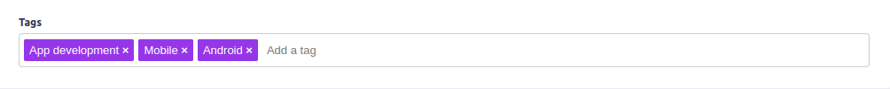
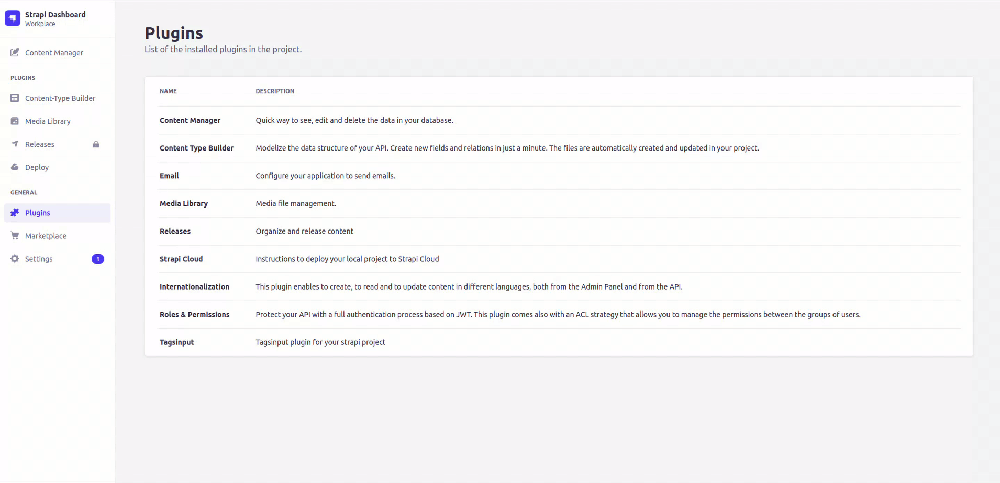

<p align="center"><a href="https://canopas.com/contact"></a></p>

<h1><strong>Tagsinput plugin for strapi with suggestions</strong></h1>

This plugin is used to add tagsinput in your strapi admin panel.
Read more about it at [tagsinput guidence](https://blog.canopas.com/the-simple-guidance-how-to-add-tagsinput-customfield-plugin-in-strapi-b5d2b5af7c3b).



## How to Install

Using npm,

```
npm i strapi-plugin-tagsinput
```

Using yarn,

```
yarn add strapi-plugin-tagsinput
```

## How to use

After installation, you can add tagsinput as a custom field.

#### Suggestions for tag

While adding tagsInput, you will see the `API URL` field.

If you want to use REST API for suggestions, then add your API url in this field.

**Notes:**

- If the API domain is different, then a full API URL is required. i.e. `http://localhost:1337/api/tags?fields[0]=name` (Make sure API CORS are enabled for your strapi domain in this case).
- Otherwise, add only the path of API i.e `/api/tags?fields[0]=name`

## Showcase

How to use tagsinput?



## Issues

If you face any issues, feel free to submit them with detailed information.

## Contributing

Feel free to fork and make a Pull Request to this plugin project. All the inputs are warmly welcome!

## Show your support ⭐️

Add a star if this project helped you.

## Credits

This repository is owned and maintained by the [Canopas team](https://canopas.com/). If you are interested in building web apps, plugins or designing products, please let us know. We'd love to hear from you!

<a href="https://canopas.com/contact"></a>

## Licence

This repository is licenced under [MIT](https://github.com/canopas/strapi-plugin-tagsinput/blob/main/LICENSE).
