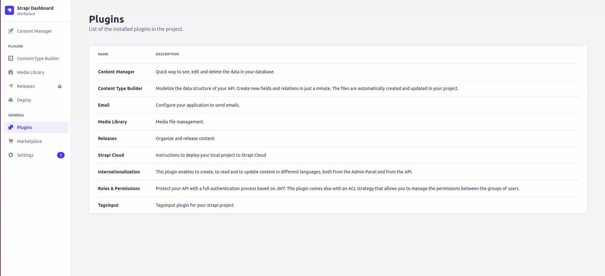

<p align="center"><a href="https://canopas.com/contact"></a></p>

<h1><strong>Tagsinput plugin for strapi with suggestions</strong></h1>

<h3>🚀<strong>Strapi 5 supported from <a href="https://github.com/canopas/strapi-plugin-tagsinput/releases/tag/2.0.2">2.0.2</a> </strong>🚀</h3>

This plugin is used to add tagsinput in your strapi admin panel.
Read more about it at [tagsinput guidence](https://blog.canopas.com/the-simple-guidance-how-to-add-tagsinput-customfield-plugin-in-strapi-b5d2b5af7c3b).


## How to Install

Using npm,

```
npm i strapi-plugin-tagsinput
```

Using yarn,

```
yarn add strapi-plugin-tagsinput
```

## How to use

After installation, you can add tagsinput as a custom field.

#### Suggestions for tag

While adding tagsInput, you will see the `API URL` field.

If you want to use REST API for suggestions, then add your API url in this field.

**Notes:**

- If the API domain is different, then a full API URL is required. i.e. `http://localhost:1337/api/tags?fields[0]=name` (Make sure API CORS are enabled for your strapi domain in this case).
- Otherwise, add only the path of API i.e `/api/tags?fields[0]=name`
- You need to add custom logic for adding created tags in `Tags` collection.

## Showcase

How to use tagsinput?



## Issues

If you face any issues, feel free to submit them with detailed information.

## Contribution

The Canopas team enthusiastically welcomes contributions and project participation! There are a bunch of things you can do if you want to contribute! The [Contributor Guide](CONTRIBUTING.md) has all the information you need for everything from reporting bugs to contributing entire new features. Please don't hesitate to jump in if you'd like to, or even ask us questions if something isn't clear.

## Show your support ⭐️

Add a star if this project helped you.

## Credits

This repository is owned and maintained by the [Canopas team](https://canopas.com/). If you are interested in building web apps, plugins or designing products, please let us know. We'd love to hear from you!

<a href="https://canopas.com/contact"></a>

## Licence

This repository is licenced under [MIT](https://github.com/canopas/strapi-plugin-tagsinput/blob/master/LICENSE).
